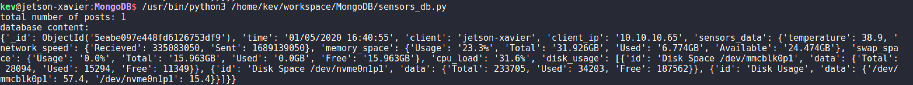
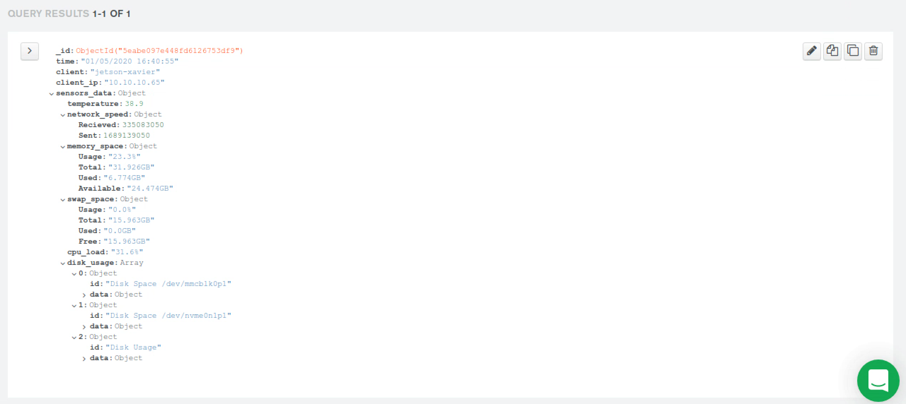

# Jetson-mongoDB-Atlas

MongoDB Atlas is a fully-managed cloud database developed by the same people that build MongoDB. Atlas handles all the complexity of deploying, managing, and healing your deployments on the cloud service provider of your choice (AWS, Azure, and GCP). You may use this service totally **FOR FREE**.

**Notes:** This software is written in Python. You may use this repo as a tool to constantly post data (ie: sensors data) from your device to your database hosted by MongoDB Atlas. If you have Python >=3.6 installed in your machine, you should be good to go. The demo below is done with a Jetson AGX Xavier DevKit. Other edge devices such as Raspberry Pi and Jetson Nano, or a normal Linux Desktop should also work.

Official Website: https://docs.atlas.mongodb.com/ \
Blog Post: https://hikariai.net

## Demo




## Setup 

### Step #0: Register a MongoDB Atlas Account

- Go to MongoDB Atlas Login Page [here](https://account.mongodb.com/account/login), log in with a Google Account, or register a new one.

### Step #1: Create a cluster

- After you successfully log in with credentials, the window will lead you to choose a plan. Just Click the leftmost option **"Shared Cluster"**
- Choose a Cloud Provider and Region, then press **"Create Cluster"**

### Step #3: Create a project

- On the very upper left corner, you will find a tab with **Project 0**, press **New Project**, create one with your own prefrence.
- Once the project has been created, you will find an option with **Build a Cluster**, follow the instructions in Step #1.
- Wait until the cluster has been succesfully created

### Step #4: Create a database

- Find the tab with **Cluster 0**, and press it
- Find the tab with **collections**, and press it
- Press **Add My Own Data**
- Type a name for the database, and a name for the collection (instance of database)
- Press **Create**

### Step #5: Build Connection

- Find the tab with **Cluster** on the left column, and press it
- Under **Cluster 0** section, you will find a tab named **CONNECT**, press it
- On the **Whitelist a connection IP address** tab, press **Add Your Current IP Address**
- On the **Create a MongoDB User** tab, type in a username and a password
- Press **Choose a Connection Method**, find the tab **Connect your application**, and press it
- From the **Driver** tab, choose **Python**, **Version** **3.6 or later**

## How To Use

### Clone the Repo
```
$ cd ~
$ git clone https://github.com/yqbu/mongoDB
$ cd mongoDB
```

### Install Software Dependencies

*** Please make sure you are using Python >=3.6
```
$ pip install pymongo pymongo[srv]
$ pip install psutil
$ pip install speedtest-cli
```

### Run
```
$ python main.py
```
